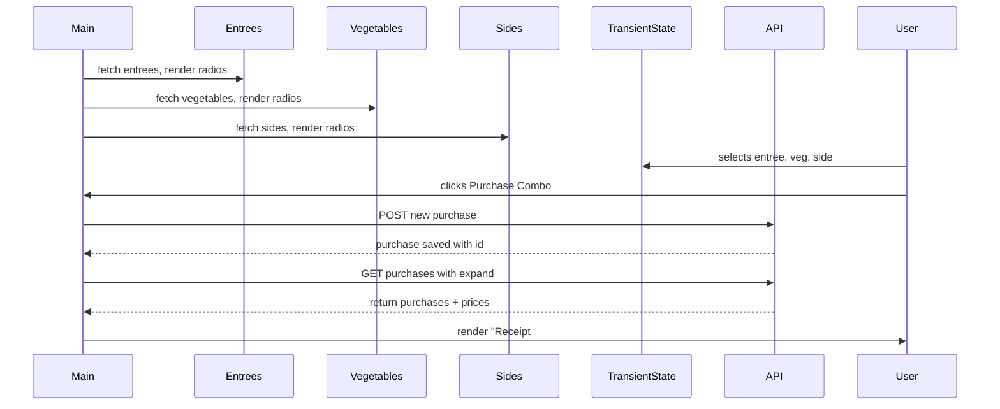

```mermaid
sequenceDiagram
    participant Main
    participant Entrees
    participant Vegetables
    participant Sides
    participant TransientState
    participant API

    Main->>Entrees: fetch entrees, render radios
    Main->>Vegetables: fetch vegetables, render radios
    Main->>Sides: fetch sides, render radios

    User->>TransientState: selects entree, veg, side
    User->>Main: clicks Purchase Combo
    Main->>API: POST new purchase
    API-->>Main: purchase saved with id
    Main->>API: GET purchases with expand
    API-->>Main: return purchases + prices
    Main->>User: render "Receipt #id = $total"
```
